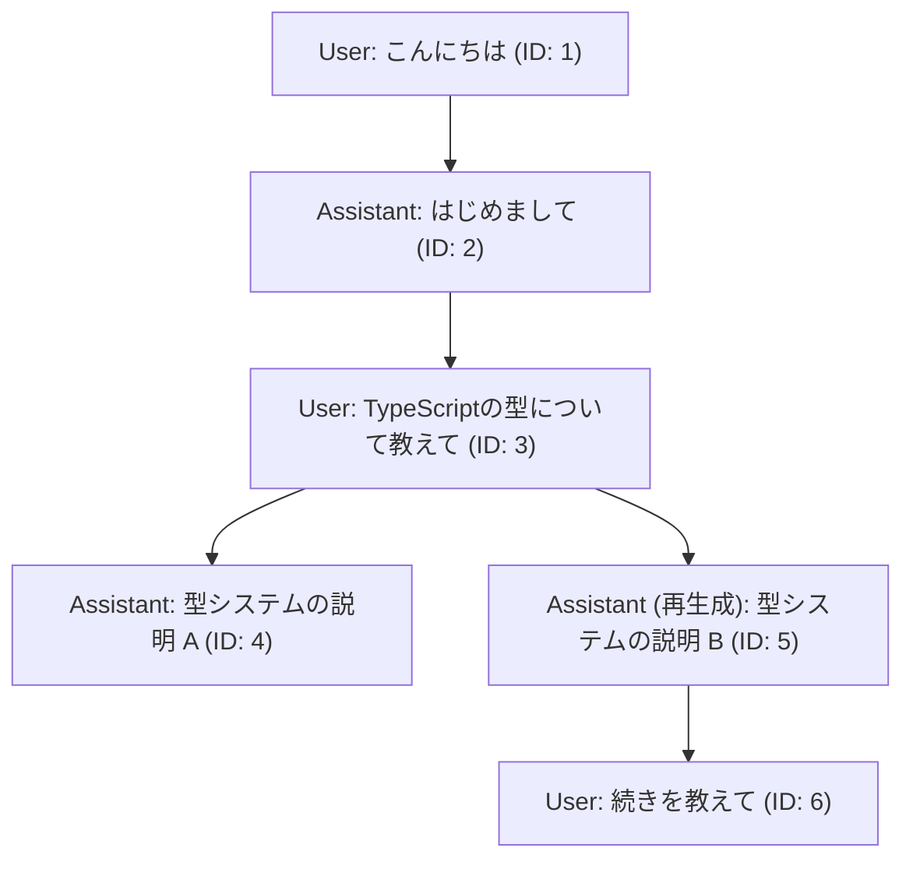
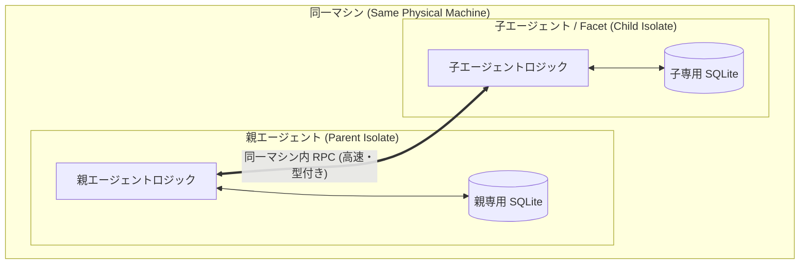
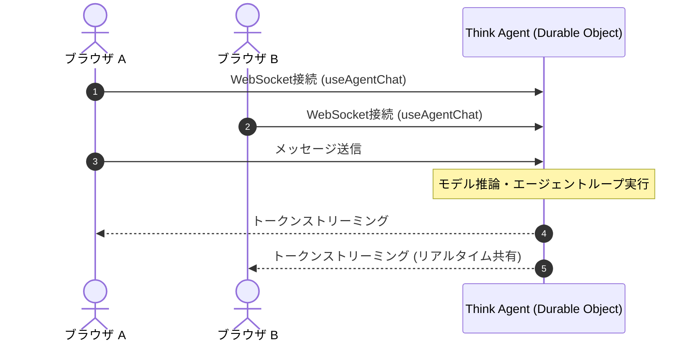

Cloudflare WorkersおよびDurable Objects（以下 DO）の上で状態を持つAIエージェントを動かすための基盤として、Cloudflare Agents SDKが提供されています。
Cloudflareは2026年4月に、Agents SDKの次世代アーキテクチャとして「Project Think」（以下 Think）を発表しました。^[Project Thinkの発表ブログで次世代のAgents SDKとして紹介されています [Project Think — Cloudflare Blog](https://blog.cloudflare.com/project-think/)]
Thinkは、長時間の実行（durable execution）、サブエージェント（sub-agents）、サンドボックス化されたコード実行（sandboxed code execution）、永続セッション（persistent session）といったプリミティブを統合したエージェントフレームワークです。

この記事では、Thinkの概要、AIChatAgentとの比較、Session APIによるメッセージ管理、Facetsによるサブエージェントの仕組み、ブラウザとの通信および`@callable`によるRPC、メソッドのオーバーライドによるカスタマイズ、プログラム起点でのターン実行（Programmatic turns）、Actionによるツールの拡張について整理します。

## Project Thinkとは

Thinkは、Cloudflare DO上で動作するAIチャットエージェントを構築するためのフレームワークです。^[Thinkの概要やコンセプトが説明されています [Think harness — Cloudflare Docs](https://developers.cloudflare.com/agents/harnesses/think/)]
DOの特性を活かし、エージェントごとに独立したIDとSQLiteストレージ、インメモリ状態が割り当てられます。クライアントとの通信がないアイドル時には自動的にハイバネーション（休止状態）へ移行し、CPU時間などのリソースを消費しません。リクエストやWebSocketメッセージ、スケジュールされたアラームなどのイベントを受信すると自動的にメモリ上へ復帰します。^[アイドル時にハイバネーションしてリソース消費を抑えるアクターモデルとしての動作が説明されています [Project Think — Cloudflare Blog](https://blog.cloudflare.com/project-think/)]

Thinkは、以下のプリミティブを内包しています。

- Fiberを用いてプロセスクラッシュからの自動回復やチェックポイントの保存を行うdurable execution
- 独立したストレージと型付きRPCを備えた子エージェントを同一マシン内に配置するsub-agents
- メッセージのツリー構造化、分岐（フォーク）、非破壊コンパクション、FTS5による全文検索を提供するpersistent session
- Dynamic Workersを活用した軽量なコード実行環境を提供するsandboxed code execution
- 冪等性や人間による承認フロー（Human-in-the-Loop）を備えたツール定義を提供するActions

ステータスとしては、2026年9月現在、ThinkおよびThinkが依存するSession APIなどはPreviewおよびExperimentalとして提供されています。^[Session APIがExperimentalとして提供されていることが明記されています [Think harness — Cloudflare Docs](https://developers.cloudflare.com/agents/harnesses/think/)]

## AIChatAgentとの比較

Cloudflare Agents SDKにおいてAIチャットを実装するための手段として、ThinkのほかにAIChatAgentが提供されています。^[AIChatAgentの仕様とチャットエージェントの実装方法が説明されています [Chat Agents — Cloudflare Docs](https://developers.cloudflare.com/agents/communication-channels/chat/chat-agents/)]

### クラス階層とプロトコル

AIChatAgentとThinkは、どちらもCloudflare Agents SDKの基底クラスである `Agent` を直接継承しています。ThinkはAIChatAgentを継承したサブクラスではありません。^[ThinkとAIChatAgentの比較表で、両者がAgentを直接継承し同じWebSocketプロトコルを共有することが説明されています [Think harness — Cloudflare Docs](https://developers.cloudflare.com/agents/harnesses/think/#think-vs-aichatagent)]

両者はクライアントとの通信において同一のWebSocketプロトコル（`cf_agent_chat_*`）を使用します。そのため、クライアント側では同じUIフック（`useAgentChat` など）を利用して両方のエージェントと通信できます。

### 比較表

両者の機能や設計の違いは以下の表の通りです。^[公式ドキュメントでAIChatAgentとThinkの詳細な比較表が提供されています [Think harness — Cloudflare Docs](https://developers.cloudflare.com/agents/harnesses/think/#think-vs-aichatagent)]

| 項目 | AIChatAgent | Think |
| --- | --- | --- |
| 基底クラス | `Agent` | `Agent` |
| 通信プロトコル | WebSocket (`cf_agent_chat_*`) | WebSocket (`cf_agent_chat_*`) |
| 最小実装行数 | 約15行 | 約3行（`getModel()` のみ） |
| 会話履歴ストレージ | フラットなSQLiteテーブル | Session API（ツリー構造、FTS5、コンパクション） |
| エージェントループ | `onChatMessage` 内で利用者が記述 | 既定の `onChatMessage` 内で自動実行 |
| メッセージ再生成 | 以前のメッセージを上書き | ツリー構造の分岐として履歴を保持 |
| サブエージェント連携 | 自前で配線 | `chat()` によるストリーミングRPC |
| 副作用ツールの制御 | 標準の `tool()` | 冪等性や承認フローを持つ `action()` |

### 実装行数と設計思想の違い

公式ドキュメントでは、最小構成の実装に必要なコード行数としてAIChatAgentが約15行、Thinkが3行（`getModel()` のみ）であると説明されています。
AIChatAgentでは、`onChatMessage` メソッドの中でVercel AI SDKの `streamText` の呼び出し、モデルの初期化、メッセージ形式の変換、レスポンスの返却といった処理を記述します。
一方のThinkでは、`getModel()` で使用するLLMモデルを指定するだけで、既定の `onChatMessage` がエージェントループ全体を自動的に実行します。

ただし、1ターン内におけるエージェントループ（LLMからの応答取得、ツール呼び出しの解釈、ツールの実行、結果の再送という反復処理）自体は、どちらの実装もVercel AI SDKの `streamText` に委ねています。
そのため、最小コード行数の差はエージェントループの配線を開発者が明示的に記述するか、フレームワーク内部で自動的に行うかという点に起因します。

Thinkの設計における大きな特徴は、メッセージの永続化とコンテキスト管理を担うSession APIにあります。会話履歴をツリー構造として保持したい場合や、全文検索、非破壊コンパクションなどの高度なセッション機能を活用したいかどうかが、Thinkを採用するか否かの判断基準となります。

## 最小実装と設定例

Thinkを用いたエージェントの最小実装例と、Wranglerの設定例を示します。

### サーバー側実装例 (`src/index.ts`)

Thinkを継承し、`getModel()` で利用するモデルを返します。^[Getting Startedドキュメントでモデルを指定する最小例が示されています [Getting started with Think — Cloudflare Docs](https://developers.cloudflare.com/agents/think/getting-started/)]

```ts:src/index.ts
import { Think } from "@cloudflare/think";
import { routeAgentRequest } from "agents";
import { createWorkersAI } from "workers-ai-provider";

export interface Env {
  AI: Ai;
  MyAgent: DurableObjectNamespace<MyAgent>;
}

export class MyAgent extends Think<Env> {
  // 利用するモデルを指定します
  getModel() {
    const workersai = createWorkersAI({ binding: this.env.AI });
    return workersai("@cf/meta/llama-3.3-70b-instruct");
  }
}

export default {
  async fetch(request: Request, env: Env): Promise<Response> {
    // クライアントからのリクエストをAgentへルーティングします
    return (await routeAgentRequest(request, env)) ?? new Response("Not found", { status: 404 });
  },
};
```

### 設定ファイル例 (`wrangler.jsonc`)

ThinkはDO上で動作し、内部でSQLiteを使用するため、DOのバインディングとマイグレーションの宣言を指定します。^[Thinkを動かすためのwrangler設定例が示されています [Think harness — Cloudflare Docs](https://developers.cloudflare.com/agents/harnesses/think/)]

```jsonc:wrangler.jsonc
{
  "name": "think-agent-example",
  "main": "src/index.ts",
  "compatibility_date": "2026-09-01",
  "compatibility_flags": ["nodejs_compat"],
  "ai": {
    "binding": "AI"
  },
  "durable_objects": {
    "bindings": [
      {
        "name": "MyAgent",
        "class_name": "MyAgent"
      }
    ]
  },
  "migrations": [
    {
      "tag": "v1",
      "new_sqlite_classes": ["MyAgent"]
    }
  ]
}
```

## Session APIによる会話履歴とコンテキストの管理

Thinkの根幹を支えるSession APIは、単なるメッセージの配列保存にとどまらないデータ構造と機能を提供します。^[セッションAPIが会話のツリー構造化や検索を提供することが説明されています [Project Think — Cloudflare Blog](https://blog.cloudflare.com/project-think/)]

### ツリー構造化メッセージ

一般的なチャットシステムでは、メッセージはフラットな配列として保存されます。これに対してSession APIでは、各メッセージが `parent_id` を持ち、ツリー構造で保存されます。



このツリー構造により、以下の操作が可能になります。

- メッセージの再生成（Regeneration）時に、古い応答を上書きや削除することなく、新しい枝（フォーク）として会話履歴を保存できます。
- 過去の任意のメッセージ時点へ巻き戻して別の対話フローを進める分岐操作を行えます。

### 非破壊コンパクション（Compaction）

長時間の会話によってコンテキストウィンドウが圧迫された際、一般的な実装では古いメッセージを削除（トリミング）します。
Session APIのコンパクションでは、過去のメッセージを削除するのではなく、要約オーバーレイを適用してモデルに渡すプロンプトを圧縮します。元のメッセージ群はSQLite内に保持され続けるため、過去の完全な会話履歴を参照できます。^[古いメッセージを削除せず要約で圧縮する非破壊コンパクションの仕組みが説明されています [Project Think — Cloudflare Blog](https://blog.cloudflare.com/project-think/)]

### FTS5による全文検索

Session APIのストレージにはSQLiteのFTS5（Full-Text Search 5）仮想テーブルが組み込まれています。これにより、単一セッション内やエージェントが持つ複数セッションを横断したメッセージの全文検索を実行できます。

## FacetsによるSub-agentsの実行

複雑なタスクを扱う場合、単一のエージェントにすべての処理を行わせるのではなく、専門的な子エージェント（サブエージェント）にタスクを委譲する設計が用いられます。Cloudflare Agents SDKでは、このサブエージェントが「Facets」という基盤上で実現されます。^[Facetsを介したサブエージェントの仕組みと分離されたSQLiteの仕様が説明されています [Sub-agents — Cloudflare Docs](https://developers.cloudflare.com/agents/runtime/execution/sub-agents/)]

### アーキテクチャと配置

親エージェントと子エージェントは、同一の物理マシン上に配置（co-located）されます。^[親と同じマシンを共有しつつSQLiteは分離される仕様が説明されています [Sub-agents — Cloudflare Docs](https://developers.cloudflare.com/agents/runtime/execution/sub-agents/)]



この構造には以下の特徴があります。

- 親と子は別々のV8 Isolateで動作し、互いのメモリ空間は分離されています。
- 子エージェントは親とは完全に独立した専用のSQLiteストレージを持ちます。データの暗黙的な共有は行われません。
- 親と子は同じマシン上で稼働するため、ネットワーク越しではなく同一マシン内の高速なRPCで通信できます。
- 子エージェントは親のFacetとして扱われるため、子クラス単体に対するWrangler設定のDOバインディングやマイグレーションの定義は不要です。親クラスのみをWranglerに登録し、子クラスはWorkerエントリーポイントからエクスポートします。

### サブエージェントの操作API

親エージェントからは、以下のようなAPIを用いて子エージェントを操作します。^[subAgentやabortSubAgent、deleteSubAgentなどの操作APIが説明されています [Sub-agents — Cloudflare Docs](https://developers.cloudflare.com/agents/runtime/execution/sub-agents/)]

- `this.subAgent(ChildClass, name)`で、指定した名前の子エージェントのRPCスタブを取得または生成します。
- `this.abortSubAgent(ChildClass, name)`で、実行中の子エージェントを強制停止します。ストレージは保持され、次回アクセス時に再開できます。
- `this.deleteSubAgent(ChildClass, name)`で、子エージェントを停止し、専用ストレージを削除します。
- `this.hasSubAgent(ChildClass, name)`で、指定した子エージェントが存在するか確認します。
- `this.listSubAgents(ChildClass)`で、生成されている子エージェントの一覧を取得します。

## ブラウザからの呼び出しとRPC

クライアント（ブラウザなど）からThinkエージェントに接続する場合、`agents/react` および `@cloudflare/ai-chat/react` パッケージを利用します。^[Client SDKのReact向けフックとWebSocket通信の仕様が説明されています [Client SDK — Cloudflare Docs](https://developers.cloudflare.com/agents/communication-channels/chat/client-sdk/)]

### WebSocketによる全二重通信

Vercel AI SDK標準の `useChat` はHTTP POSTを前提とした単発のリクエスト・レスポンス方式です。これに対してCloudflare Agentの `useAgentChat` は、内部でWebSocket接続を確立します。^[useAgentChatがAI SDKのuseChatをWebSocketでラップしていることが説明されています [Chat Agents — Cloudflare Docs](https://developers.cloudflare.com/agents/communication-channels/chat/chat-agents/)]

WebSocketを採用している理由は以下の通りです。

- 同一エージェントインスタンスに複数のクライアントが接続している際、メッセージや状態の変更を接続中の全クライアントへリアルタイムにブロードキャストするためです。
- サーバー側で発生したイベント（定期タスクの完了や別経路からのメッセージ受信など）をクライアントへプッシュ通知するためです。
- ネットワーク瞬断時におけるストリーミングの再開や自動再接続を制御するためです。



### クライアント側実装例 (React)

Reactコンポーネント内では、`useAgent` でエージェントインスタンスへの接続を確立し、そのエージェントを `useAgentChat` に渡してチャットUIを構築します。

```tsx:src/ChatComponent.tsx
import { useAgent } from "agents/react";
import { useAgentChat } from "@cloudflare/ai-chat/react";

export function ChatComponent() {
  // エージェントインスタンスへのWebSocket接続を確立します
  const agent = useAgent({
    agent: "MyAgent",
    name: "user-session-123",
  });

  // チャット用の状態管理フックを呼び出します
  const { messages, input, handleInputChange, handleSubmit } = useAgentChat({
    agent,
  });

  return (
    <div>
      <div>
        {messages.map((m) => (
          <div key={m.id}>
            <span>{m.role}: </span>
            <span>{m.content}</span>
          </div>
        ))}
      </div>
      <form onSubmit={handleSubmit}>
        <input value={input} onChange={handleInputChange} />
        <button type="submit">送信</button>
      </form>
    </div>
  );
}
```

### @callableデコレータによるRPC

エージェントクラスのメソッドに `@callable` デコレータを付与すると、そのメソッドがWebSocket経由のRPCとしてクライアントへ公開されます。^[AgentクラスのメソッドをWebSocket RPCとして公開する@callableの仕様が説明されています [Callable methods — Cloudflare Docs](https://developers.cloudflare.com/agents/api-reference/callable-methods/)]

```ts:src/index.ts
import { Think } from "@cloudflare/think";
import { callable } from "agents";

export class MyAgent extends Think<Env> {
  // クライアントからRPCとして呼び出し可能なメソッドを定義します
  @callable()
  async updateUserSettings(theme: string, notificationsEnabled: boolean) {
    // 処理ロジック
    return { success: true };
  }
}
```

クライアント側からは、`agent.stub.updateUserSettings("dark", true)` のように呼び出すことができます。これはNext.jsのServer Actionsのように、クライアントからサーバー上の関数を直接実行する形態をとります。

ただし、`@callable` メソッドを利用する際は以下の点に注意が必要です。

- 引数や戻り値はJSON直列化可能な値である必要があります（関数やDateインスタンスなどは渡せません）。
- フレームワーク側で引数のスキーマ検証（バリデーション）は行われません。TypeScriptの型定義はコンパイル時に消去されるため、実行時には型の異なる値や悪意のあるペイロードが渡される可能性があります。そのため、メソッド本体の先頭でZodなどを用いて引数の妥当性を明示的に検証する必要があります。^[デコレータ側でスキーマ検証が行われないため実装側での入力検証が必要であることが説明されています [Callable methods — Cloudflare Docs](https://developers.cloudflare.com/agents/api-reference/callable-methods/)]

## 挙動のカスタマイズ（オーバーライド）

Thinkは用意されているメソッドをサブクラス側でオーバーライドすることで挙動をカスタマイズできます。^[オーバーライド可能な設定メソッドとライフサイクルフックが一覧されています [Configuration — Cloudflare Docs](https://developers.cloudflare.com/agents/harnesses/think/configuration/)]

### 設定系メソッド

エージェントの構成を変更するための主なメソッドは以下の通りです。

- `getModel()`で、使用するLLMモデルインスタンスを返します。
- `getSystemPrompt()`で、エージェントの基本指示（システムプロンプト）を定義します。
- `getTools()`で、モデルに提供する独自のツール群（AI SDKの `tool()` 形式）を返します。
- `configureSession()`で、セッションの設定を行います。読み取り専用のID情報（Soul）や書き込み可能な事実情報（Memory）などのContext Blockの定義、コンパクション方針、全文検索の設定を指定します。
- `getScheduledTasks()`で、定期実行するバックグラウンドタスクを宣言します。

### ライフサイクルフック

ターンの進行に合わせて発火するフックメソッドをオーバーライドすることで、ログ記録や推論制御を挟み込めます。^[ターンやステップごとに発火するライフサイクルフックの順序が説明されています [Lifecycle hooks — Cloudflare Docs](https://developers.cloudflare.com/agents/harnesses/think/lifecycle-hooks/)]

- `beforeTurn`は、ターン開始前に呼び出され、コンテキストや設定を改変できます。
- `beforeStep`は、1回の推論ステップの前に呼び出されます。
- `beforeToolCall`は、モデルがツール呼び出しを決定した直後に発火し、実行の許可・差し替え・ブロックを判定できます。
- `afterToolCall`は、ツールの実行完了後に発火します。
- `onStepFinish`は、推論ステップの完了時に発火します。
- `onChunk`は、ストリーミングのチャンク受信時に発火します。
- `onChatResponse`は、ターン全体のレスポンス完了時に発火します。

## Programmatic turns（プログラム起点でのターン実行）

チャット画面からのユーザー操作以外にも、Webhookの受信や外部からのRPC呼び出し、スケジュール実行などを契機としてエージェントのターンを起動したいケースがあります。これらを「Programmatic turns」と呼び、Thinkには複数の実行メソッドが用意されています。^[Programmatic submissionsの仕様と各メソッドの使い分けが解説されています [Programmatic submissions — Cloudflare Docs](https://developers.cloudflare.com/agents/harnesses/think/programmatic-submissions/)]

### 主なメソッド

- `saveMessages(messages, options)`は、メッセージを会話履歴に追加してターンを起動し、推論の完了まで待機します。同期的に結果を受け取りたい処理に適しています。
- `submitMessages(messages, options)`は、メッセージを永続化レジャー（キューテーブル）に保存して即時応答します。推論の完了を待機しないため、Webhookハンドラや外部RPCのように高速なHTTP応答が求められる場面で用いられます。
- `continueLastTurn(body?, options?)`は、新規メッセージを追加せず、直前のアシスタントの回答に続けて追加の推論を実行します。モデルの応答が途中で途切れた際の継続生成や、ツールの確定結果を受けた自己修正などに用いられます。

これらは現在、統一されたエントリーポイントである `runTurn(options)` の内部実装に集約されています。`runTurn` には結果を待つ `wait` モード、即座に受理する `submit` モード、ストリーミングで受け取る `stream` モードが用意されています。^[runTurnが全ターン起動手段の統一エントリーポイントとして設計されていることが説明されています [Think harness — Cloudflare Docs](https://developers.cloudflare.com/agents/harnesses/think/#runturn)]

### submitMessagesの冪等性と状態管理

Webhookなどを処理する場合、ネットワークのタイムアウトによって同一リクエストが再送される可能性があります。`submitMessages` では、オプションとして `idempotencyKey` を指定できます。^[idempotencyKeyを用いた重複防止とsubmissionの状態遷移が説明されています [Programmatic submissions — Cloudflare Docs](https://developers.cloudflare.com/agents/harnesses/think/programmatic-submissions/)]

- 同一の `idempotencyKey` を持つリクエストが再度送られた場合、新規メッセージとして登録せず、既存のSubmissionを返却します。
- 各Submissionは `pending` → `running` → `completed`（または `error`, `aborted`, `skipped`）という状態を持ちます。
- 登録されたSubmissionは、`inspectSubmission` や `cancelSubmission`、`listSubmissions` といったAPIを通じて状態照会やキャンセルが可能です。

## Actionによるツールの拡張

AIエージェントが外部APIを呼び出したりデータベースを更新したりする場合、通常の関数ツール（AI SDKの `tool()`）だけでは安全性の担保が困難なケースがあります。Thinkでは、副作用を持つツールを安全に運用するための仕組みとして `action()` 記述子が提供されています。^[副作用ツール向けのaction記述子の仕様が説明されています [Actions — Cloudflare Docs](https://developers.cloudflare.com/agents/harnesses/think/actions/)]

Actionは、標準的な `tool()` に対して以下の機能を追加します。

- `idempotencyKey` を指定することで実行結果がDOの永続レジャーに記録され、プロセスの再起動やリトライ時にも処理本体（`execute`）の多重実行を防ぎ、保存済みの結果を即座に返します。
- `approval` オプションを指定することで、モデルがアクションの実行を試みた際に処理を一時停止（Pause）し、ブラウザUIやダッシュボードから人間が `approveExecution` または `rejectExecution` を呼び出すまで待機させる承認フロー（Human-in-the-Loop）を組み込めます。
- `permissions` の宣言により、ターン単位やアクション単位での実行権限を制御できます。
- `ctx.attachReply()` を用いて、チャットメッセージとは別にメール下書きやUIカードなどの配送用メタデータを添付できます。

読み取り専用の検索処理などは標準の `tool()` を利用し、決済やメール送信、外部更新といった副作用を伴う操作には `action()` を利用するという使い分けが行われます。

## まとめ

Cloudflare Project Thinkは、Cloudflare DOの分散ステートフル基盤の上に構築されたAIエージェントフレームワークです。

- DOのアクターモデルに基づき、エージェントごとに独立した実行環境とSQLiteストレージを持ち、アイドル時には自動ハイバネーションします。
- AIChatAgentと比較して、Session APIによるツリー構造メッセージ、非破壊コンパクション、全文検索などの高度な永続化機能を標準で備えています。
- サブエージェントはFacets基盤上で同一マシン内に配置され、別々のIsolateとストレージを保ちながら高速なRPCで連携します。
- ブラウザクライアントとはWebSocketによる双方向通信を行い、リアルタイムなストリーミングやブロードキャスト、`@callable` によるRPC呼び出しを実現します。
- プログラム起点での実行（`submitMessages` など）における冪等性の担保や、`action()` による承認フローなど、本番運用を見据えた安全機構が組み込まれています。

## 参考

- [Project Think — Cloudflare Blog](https://blog.cloudflare.com/project-think/)
- [Think harness — Cloudflare Docs](https://developers.cloudflare.com/agents/harnesses/think/)
- [Getting started with Think — Cloudflare Docs](https://developers.cloudflare.com/agents/think/getting-started/)
- [Configuration — Cloudflare Docs](https://developers.cloudflare.com/agents/harnesses/think/configuration/)
- [Lifecycle hooks — Cloudflare Docs](https://developers.cloudflare.com/agents/harnesses/think/lifecycle-hooks/)
- [Programmatic submissions — Cloudflare Docs](https://developers.cloudflare.com/agents/harnesses/think/programmatic-submissions/)
- [Sub-agents — Cloudflare Docs](https://developers.cloudflare.com/agents/runtime/execution/sub-agents/)
- [Actions — Cloudflare Docs](https://developers.cloudflare.com/agents/harnesses/think/actions/)
- [Callable methods — Cloudflare Docs](https://developers.cloudflare.com/agents/api-reference/callable-methods/)
- [Chat Agents — Cloudflare Docs](https://developers.cloudflare.com/agents/communication-channels/chat/chat-agents/)
- [Client SDK — Cloudflare Docs](https://developers.cloudflare.com/agents/communication-channels/chat/client-sdk/)
