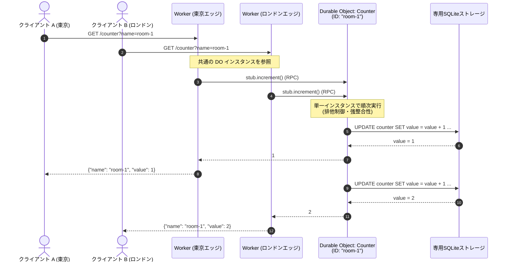
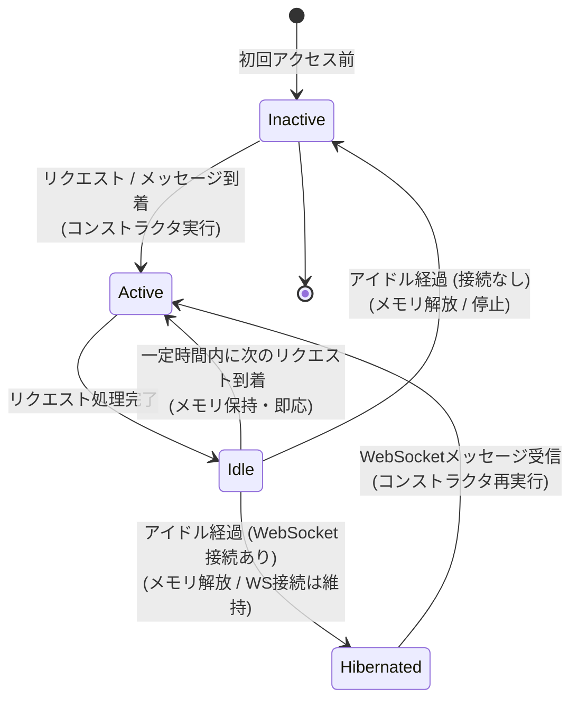
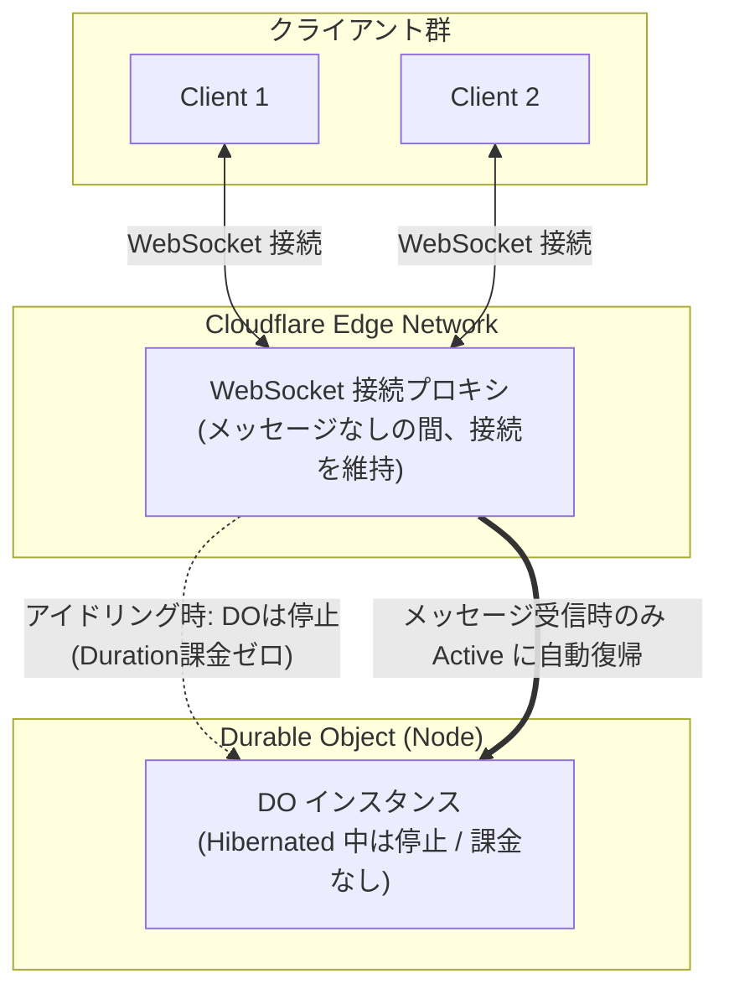

Cloudflare Workers をはじめとするエッジコンピューティングは、世界中に分散したサーバーからミリ秒単位で高速に応答できる一方で、**「状態（ステート）をどう共有・更新するか」**という壁にぶつかりやすい。

ステートレスな Workers を分散配置すると、複数拠点から同時に書き込みがあった際の整合性（Consistency）を保つのが難しくなり、外部のデータベースに依存するとエッジの低レイテンシという強みが相殺されてしまう。

この課題を解決するために Cloudflare が提供している仕組みが **Durable Objects (以下 DO)** である。

この記事では、DOの基本的な仕組み、コード例を通じた動作モデル、ライフサイクル、D1との違い、そして料金体系までを一通り整理する。

---

## この記事で扱うこと

- Durable Objects とは何か（Actorモデル、強整合性の実現）
- 動作サンプル（カウンター実装と呼び出しフロー）
- DOのライフサイクルと状態管理の注意点
- 接続コストを劇的に下げる WebSockets Hibernation
- ORM（Drizzle / Kysely）の活用
- Cloudflare D1 との違いと使い分け
- 料金体系（Compute / Storage）の読み解き方

---

## Durable Objects とは何か

Durable Objects は、**ユニークな ID（または名前）ごとに動的生成される、ステートフルな特殊な Cloudflare Worker** である。

主な特徴は以下の通りである。

1. **グローバルで唯一のインスタンス（強整合性）**
   ある ID に対して割り当てられる DO インスタンスは、全世界の Cloudflare ネットワーク上で常に「同時に最大 1 つ」しか起動しない。世界中のエッジ Worker から同一 ID の DO を参照すると、すべて同じ単一のインスタンスにルーティングされる。このため、分散環境特有の競合状態（Race Condition）を気にせず、インメモリで強整合性のある状態を扱える。
2. **インスタンス専用の高速ストレージ（SQLiteベース）**
   DO はインスタンスごとに独立した専用ストレージ（SQLite）を抱えている。コンピュート処理系とストレージが同一マシン（同一ノード）にコロケーションされているため、ネットワークオーバーヘッドなしに高速な永続化を行える。
3. **Actor モデルとしてのアーキテクチャ**
   DO は並行処理における「Actor モデル」とみなすことができる。「状態（メモリ＋ストレージ）」と「それを操作するロジック（クラスメソッド）」がカプセル化されており、外部の Worker からはメッセージ（RPC 呼び出し）を送ることで対話する。
4. **自動アイドルとゼロスケール**
   一定時間アクセスがない DO は自動的にアイドル（Hibernated / Inactive）状態へ遷移し、メモリから解放される。これにより、アイドル中はコンピュート課金が発生しない。

---

## 動作サンプル: カウンター

複数のエッジ Worker から共通の DO を参照し、安全に数値をインクリメントするカウンターの実装を見ていく。

### アーキテクチャのイメージ

世界各地のクライアントからリクエストを受けた Worker が、指定された名前（`room-1`）の DO スタブを取得して RPC メソッドを呼び出す。DO は単一インスタンスとして動作し、順次処理を行うため整合性が保たれる。



### TypeScript 実装例

以下は Workers RPC を利用した最新の書き方である。

```ts:src/index.ts
import { DurableObject } from "cloudflare:workers";

export interface Env {
  COUNTERS: DurableObjectNamespace<Counter>;
}

// 1. Durable Object クラスの定義
export class Counter extends DurableObject<Env> {
  constructor(ctx: DurableObjectState, env: Env) {
    super(ctx, env);

    // インスタンス専用の SQLite ストレージを初期化
    this.ctx.storage.sql.exec(`
      CREATE TABLE IF NOT EXISTS counter (
        id INTEGER PRIMARY KEY,
        value INTEGER NOT NULL
      );

      INSERT OR IGNORE INTO counter (id, value)
      VALUES (1, 0);
    `);
  }

  // 外部 Worker から直接 RPC 呼び出しされるメソッド
  async increment(): Promise<number> {
    const row = this.ctx.storage.sql
      .exec<{ value: number }>(`
        UPDATE counter
        SET value = value + 1
        WHERE id = 1
        RETURNING value
      `)
      .one();

    return row.value;
  }
}

// 2. 外部からのリクエストを受け付ける Worker
export default {
  async fetch(request: Request, env: Env): Promise<Response> {
    const name =
      new URL(request.url).searchParams.get("name") ?? "default";

    // 名前から DO のスタブ（通信用クライアント）を取得
    const stub = env.COUNTERS.getByName(name);

    // DO インスタンスのメソッドを RPC 実行
    const value = await stub.increment();

    return Response.json({ name, value });
  },
};
```

### コードのポイント

- **動的生成とスタブ取得**:
  `env.COUNTERS.getByName(name)` で参照すると、指定した名前に対応する DO インスタンスがネットワーク上に動的に配置・初期化される。
- **コンストラクタの実行タイミング**:
  DO インスタンスの生成時（またはアイドル復帰時）に `Counter` クラスの `constructor` が実行される。
- **インスタンス上での実行（RPC）**:
  `stub.increment()` は呼び出し元 Worker のプロセスではなく、DO が稼働しているリモートマシン上で実行される。
- **専用の SQLite ストレージ (`ctx.storage.sql`)**:
  DO は各インスタンス専用の組み込み SQLite を持っている。このストレージはインスタンスごとに完全に分離されている。
:::message
システム全体で横断的に共有するリレーショナルデータベースが必要な場合は、個別の DO ではなく **Cloudflare D1** を使用する。
:::

### 設定ファイル例 (`wrangler.jsonc`)

Durable Objects で SQLite ストレージを利用する場合、設定ファイルでバインディングとマイグレーションの宣言が必要になる。

```jsonc:wrangler.jsonc
{
  "name": "do-counter-example",
  "main": "src/index.ts",
  "compatibility_date": "2026-01-01",
  "durable_objects": {
    "bindings": [
      {
        "name": "COUNTERS",
        "class_name": "Counter"
      }
    ]
  },
  "migrations": [
    {
      "tag": "v1",
      "new_sqlite_classes": ["Counter"]
    }
  ]
}
```

---

## DO のライフサイクル

DO を運用する上で最も理解しておくべきなのがライフサイクルとメモリの揮発性である。



### 状態遷移の流れ

1. **Active**:
   リクエスト（HTTP / RPC / WebSocketメッセージ / アラーム）を受信するとインスタンスが立ち上がり、コンストラクタが実行されて Active になる。
2. **Idle**:
   リクエストの処理が終わると直ちには破棄されず、短時間はメモリ上の状態を保持したまま Idle 状態で待機する。この間に次のリクエストが来れば、コンストラクタを再実行することなく即座に復帰する。
3. **Hibernated / Inactive**:
   Idle のまま一定時間が経過すると、インスタンスはメモリからアンロードされる。

:::message alert
**状態遷移をフックして処理を実行することはできない点に注意**
「インスタンスが破棄される直前にメモリの値をDBに保存する」といったコールバック（onDestroyのようなもの）は存在しない。そのため、失われて困るメモリ上のステートは、リクエスト処理の最中に `ctx.storage.sql` を使って確実に永続化しておく必要がある。
:::

公式ドキュメントの詳細なライフサイクル図も参考になる：
- [Durable Object Lifecycle — Cloudflare Docs](https://developers.cloudflare.com/durable-objects/concepts/durable-object-lifecycle/)

---

## WebSockets Hibernation: コネクション維持とコスト削減

リアルタイムチャットや共同編集ツールを構築する際、WebSocket 接続の維持は大きな課題になる。

一般的なサーバーレスアーキテクチャでは、クライアントが接続を維持している間中、常時プロセスが稼働し続けてコンピュート課金（Duration課金）が膨らんでしまう。

Durable Objects は **WebSockets Hibernation API** を備えており、この問題を根本から解消している。



### 仕組みとメリット

- **接続維持をエッジネットワークが肩代わり**:
  クライアントとの WebSocket 接続は Cloudflare のエッジ基盤側で維持される。
- **DO は通信がない間停止（Hibernate）可能**:
  DO 自身はメモリから退避して停止するため、メッセージのやり取りがない間は **Duration 課金が発生しない**。
- **メッセージ到着時に自動復帰**:
  いずれかのクライアントからメッセージが届くと、DO は自動的に復帰（Active 化）し、`webSocketMessage` ハンドラを実行する。

1 万クライアントが接続していても、実際にメッセージが流れていないアイドリング時間帯のコンピュート料金をほぼゼロに抑えることができる。

---

## ORM の利用

DO のストレージは標準的な SQLite であるため、`ctx.storage.sql.exec` をラップするドライバがあれば各種 TypeScript ORM をそのまま利用できる。

### 1. Drizzle ORM

Drizzle は公式に Durable Objects 向けドライバを提供している。

- [Drizzle ORM — Cloudflare Durable Objects](https://orm.drizzle.team/docs/get-started/do-existing)

```ts:src/user-do.ts
import { drizzle } from "drizzle-orm/durable-sqlite";
import { integer, sqliteTable, text } from "drizzle-orm/sqlite-core";
import { eq } from "drizzle-orm";

export const users = sqliteTable("users", {
  id: integer("id").primaryKey(),
  name: text("name").notNull(),
});

export class MyDurableObject extends DurableObject {
  private db = drizzle(this.ctx.storage);

  async getUser(id: number) {
    return await this.db.select().from(users).where(eq(users.id, id));
  }
}
```

### 2. Kysely

型安全なクエリビルダーである Kysely も、コミュニティ製ドライバを利用して DO 上で動作させることが可能である。

- [@oselvar/kysely-cloudflare](https://www.npmjs.com/package/@oselvar/kysely-cloudflare)

生 SQL の文字列結合を避け、型定義を効かせたスキーマ管理やマイグレーションを行いたい場合には ORM の導入が推奨される。

---

## Cloudflare D1 との違い

Cloudflare でデータベースを扱う際、Durable Objects と Cloudflare D1 のどちらを選ぶべきか迷うことがある。両者の違いを整理する。

### 比較表

| 項目 | Durable Objects (DO) | Cloudflare D1 |
| --- | --- | --- |
| **アーキテクチャ** | 処理系（Worker）＋ 専用 SQLite ストレージ | マネージド SQLite データベースサービス |
| **インスタンス生成** | ID・名前単位で**動的に無数生成** | データベース単位で**静的に作成** |
| **配置・コロケーション** | 処理系とストレージが同一マシンに同居 | Worker と D1 ストレージはネットワーク経由 |
| **ステートの持ち方** | インメモリ状態 ＋ SQLite ストレージ | SQLite ストレージのみ |
| **整合性** | 強整合性（単一インスタンスで排他実行） | 結果整合性（Primary + Read Replica） |
| **Read Replica** | なし（常に単一インスタンスへルーティング） | あり（リードレプリカで読み込みスケール可） |
| **主な用途** | ルームチャット、同時編集、ゲームセッション、レートリミッタ | サービス全体のユーザーテーブル、共通マスタデータ、CMS |

### D1 のバックエンドは DO で作られている

興味深い事実として、**D1 は内部的に 1 つの Durable Object を使って実装されている**。

D1 は DO が持つ「単一インスタンスによる強整合性な書き込み」と「組み込み SQLite」の性質を利用して作られた、上位のマネージド DB サービスと言える。

- **D1 を選ぶべきケース**:
  アプリケーション全体で共有する単一のスキーマ・データ群があり、複数テーブルの JOIN や集計、リードレプリカによる読み取りスケーラビリティが欲しい場合。
- **DO を選ぶべきケース**:
  「ユーザーごと」「ドキュメントごと」「チャットルームごと」のように、明確な境界を持つステートと処理をセットで閉じ込めたい場合。インメモリの高速な状態同期や WebSocket を併用したい場合。

---

## 料金体系

Durable Objects の課金は **Compute（計算資源）** と **Storage（ストレージ）** の 2 軸で計算される。有料枠（Paid）は Workers Paid（月額最低 $5）に含まれる。

### 1. Compute 料金

| 項目 | Free | Paid | 備考 |
| --- | --- | --- | --- |
| **Requests** | 10万件 / 日 | 月100万件まで無料、超過 $0.15 / 100万件 | HTTP・RPC・WSメッセージ・アラームを含む |
| **Duration**<br/>(wall-clock × 128MB換算) | 1.3万 GB-秒 / 日 | 月40万 GB-秒まで無料、超過 $12.50 / 100万 GB-秒 | `Active` および `Idle non-hibernateable` のみ課金 |

#### 通常の Workers (Paid) との比較

- **リクエスト単価は半額**:
  通常 Workers のリクエスト料金（$0.30 / 100万件）に対して、DO のリクエスト料金は **$0.15 / 100万件と半額** に設定されている。
- **Duration 課金の有無**:
  通常 Workers Paid は Duration 課金がなく「CPU 実行時間（CPU time）」で課金される。一方、DO は **wall-clock 時間（実経過時間 × メモリ量）** で課金される。
  ただし、前述の WebSockets Hibernation や自動アイドルにより、処理をしていない待機時間の Duration 課金は回避できる。

### 2. Storage 料金 (SQLite)

DO のストレージ料金は、Cloudflare D1 と同一の体系である。

| 項目 | Free | Paid | 備考 |
| --- | --- | --- | --- |
| **Rows read** | 500万行 / 日 | 月250億行まで無料、超過 $0.001 / 100万行 | `get` 等のキー指定取得も行換算 |
| **Rows written** | 10万行 / 日 | 月5000万行まで無料、超過 $1.00 / 100万行 | `delete` や `setAlarm` も 1行扱い |
| **Stored data** | 5 GB | 5 GB-月まで無料、超過 $0.20 / GB-月 | 空のDB（約12KB）も課金対象 |

---

## まとめ

Durable Objects の本質は、**「エッジの分散環境において、特定 ID に対する単一の実行コンテキストと専用ストレージを提供する」** という点にある。

- **強整合性の確保**: 単一インスタンスへのルーティングにより、複雑な分散ロックなしに競合を回避できる。
- **超低レイテンシ**: インメモリ状態の活用と、処理系と SQLite ストレージのコロケーションによる高速なデータ操作。
- **リアルタイム処理に最適**: WebSockets Hibernation によって、常時接続の待機コストを最小化できる。
- **D1 との使い分け**: 全体共有の RDBMS は D1、個別のエンティティ（部屋・セッション・ユーザー）に閉じたステートフル処理は DO。

エッジで状態を持つアーキテクチャを検討する際は、ぜひ選択肢に入れておきたい強力なプリミティブである。

---

## 参考

- [Durable Objects Overview — Cloudflare Docs](https://developers.cloudflare.com/durable-objects/)
- [Durable Object Lifecycle — Cloudflare Docs](https://developers.cloudflare.com/durable-objects/concepts/durable-object-lifecycle/)
- [Use WebSockets in Durable Objects — Cloudflare Docs](https://developers.cloudflare.com/durable-objects/best-practices/websockets/#durable-objects-hibernation-websocket-api)
- [Durable Objects Pricing — Cloudflare Docs](https://developers.cloudflare.com/durable-objects/platform/pricing/)
- [Workers Pricing — Cloudflare Docs](https://developers.cloudflare.com/workers/platform/pricing/)
- [Drizzle ORM — Durable SQLite](https://orm.drizzle.team/docs/get-started/do-existing)
- [@oselvar/kysely-cloudflare — npm](https://www.npmjs.com/package/@oselvar/kysely-cloudflare)
