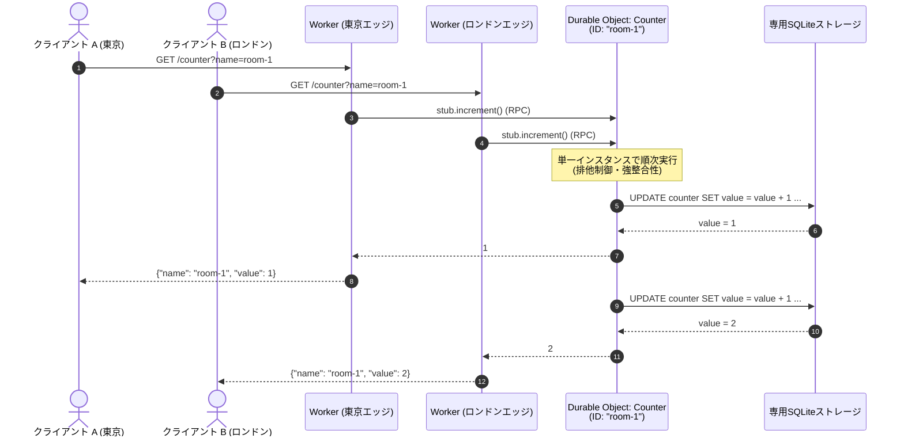
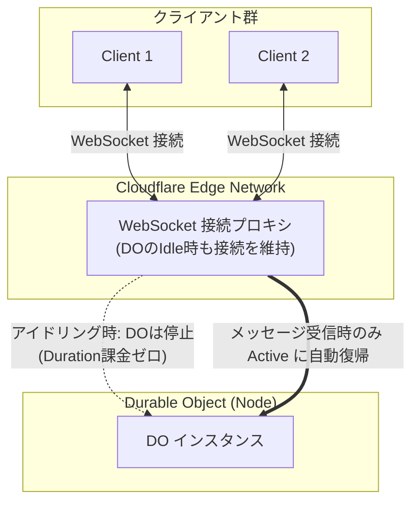

Cloudflare Workersをはじめとするエッジコンピューティングでは、世界中に分散したサーバーから応答を返します。一方で、状態（ステート）を共有・更新する方法を検討する必要があります。
ステートレスなWorkersを分散配置した場合、複数拠点からの同時書き込みに対する整合性の確保が課題になります。
Cloudflareでは分散SQLiteサーバであるD1の他に、ActorモデルであるDurable Objects (以下 DO) を提供しています。

この記事では、DOの仕組み、コード例、ライフサイクル、D1との違い、料金体系について整理します。

## Durable Objects とは

Durable Objectsは、ユニークなID（または名前）ごとに生成される、ステートフルなCloudflare Workerです。

主な特徴は以下の通りです。

1. グローバルで唯一のインスタンス
 あるIDに対して割り当てられるDOインスタンスは、Cloudflareネットワーク上で同時に最大1つ起動します。異なるエッジのWorkerから同一IDのDOを参照した場合、すべて同じインスタンスにルーティングされます。このため、インメモリで強整合性のある状態を扱えます。
2. インスタンス専用のストレージ
 DOはインスタンスごとに独立した専用ストレージ（SQLite）を持ちます。処理とストレージは同一マシンに配置されます。
3. Actorモデルとしてのアーキテクチャ
 DOはActorモデルとして説明できます。状態（メモリとストレージ）とそれを操作するロジック（クラスメソッド）がカプセル化されています。外部のWorkerからはRPC呼び出しで対話します。
4. 自動アイドル
 一定時間アクセスがないDOは自動的にアイドル（Hibernated / Inactive）状態へ遷移し、メモリから解放されます。アイドル中はコンピュート課金は発生しません。

---

## 動作サンプル: カウンター

複数のエッジWorkerから共通のDOを参照し、数値をインクリメントするカウンターの実装を示します。

### アーキテクチャのイメージ

世界各地のクライアントからリクエストを受けたWorkerが、指定された名前（`room-1`）のDOスタブを取得してRPCメソッドを呼び出します。DOは単一インスタンスとして動作し、順次処理を行います。



### TypeScript 実装例

以下はWorkers RPCを利用した書き方です。

```ts:src/index.ts
import { DurableObject } from "cloudflare:workers";

export interface Env {
  COUNTERS: DurableObjectNamespace<Counter>;
}

// 1. Durable Object クラスの定義
export class Counter extends DurableObject<Env> {
  constructor(ctx: DurableObjectState, env: Env) {
    super(ctx, env);

    // インスタンス専用の SQLite ストレージを初期化
    this.ctx.storage.sql.exec(`
      CREATE TABLE IF NOT EXISTS counter (
        id INTEGER PRIMARY KEY,
        value INTEGER NOT NULL
      );

      INSERT OR IGNORE INTO counter (id, value)
      VALUES (1, 0);
    `);
  }

  // 外部 Worker から直接 RPC 呼び出しされるメソッド
  async increment(): Promise<number> {
    const row = this.ctx.storage.sql
      .exec<{ value: number }>(`
        UPDATE counter
        SET value = value + 1
        WHERE id = 1
        RETURNING value
      `)
      .one();

    return row.value;
  }
}

// 2. 外部からのリクエストを受け付ける Worker
export default {
  async fetch(request: Request, env: Env): Promise<Response> {
    const name =
      new URL(request.url).searchParams.get("name") ?? "default";

    // 名前から DO のスタブ（通信用クライアント）を取得
    const stub = env.COUNTERS.getByName(name);

    // DO インスタンスのメソッドを RPC 実行
    const value = await stub.increment();

    return Response.json({ name, value });
  },
};
```

### コードのポイント

- 動的生成とスタブ取得:
`env.COUNTERS.getByName(name)`で参照すると、指定した名前に対応するDOインスタンスが配置・初期化されます。
- コンストラクタの実行タイミング:
DOインスタンスの生成時（またはアイドル復帰時）に`Counter`クラスの`constructor`が実行されます。
- インスタンス上での実行（RPC）:
`stub.increment()`は呼び出し元Workerのプロセスではなく、DOが稼働しているマシン上で実行されます。
- 専用のSQLiteストレージ (`ctx.storage.sql`):
DOは各インスタンス専用の組み込みSQLiteを持ちます。このストレージはインスタンスごとに分離されています。
:::message
システム全体で共有するリレーショナルデータベースが必要な場合は、個別のDOではなく Cloudflare D1 を使用します。
:::

### 設定ファイル例 (`wrangler.jsonc`)

Durable ObjectsでSQLiteストレージを利用する場合、設定ファイルでバインディングとマイグレーションの宣言が必要です。

```jsonc:wrangler.jsonc
{
  "name": "do-counter-example",
  "main": "src/index.ts",
  "compatibility_date": "2026-01-01",
  "durable_objects": {
    "bindings": [
      {
        "name": "COUNTERS",
        "class_name": "Counter"
      }
    ]
  },
  "migrations": [
    {
      "tag": "v1",
      "new_sqlite_classes": ["Counter"]
    }
  ]
}
```

---

## DO のライフサイクル

DOは、処理を行なっていない時間が続くと自動的に停止します。具体的にはActive, Inactive, Hibernated, Idleの4つの状態を持ち、以下の図のような状態遷移を行います。


from [Durable Object Lifecycle — Cloudflare Docs](https://developers.cloudflare.com/durable-objects/concepts/durable-object-lifecycle/)

### 状態遷移のポイント

1. Active:
 リクエスト（HTTP / RPC / WebSocketメッセージ / アラーム）を受信するとインスタンスが立ち上がります。コンストラクタが実行されてActiveになります。
2. Idle:
 リクエストの処理が終わると、メモリ上の状態を保持したまま短時間Idle状態で待機します。この間に次のリクエストが来た場合は、コンストラクタを再実行せずに復帰します。
3. Hibernated / Inactive:
 Idleのまま一定時間が経過すると、インスタンスはメモリからアンロードされます。

:::message
状態遷移をフックして処理を実行することはできません。「インスタンスが破棄される直前にメモリの値をDBに保存する」といったコールバック（onDestroyのようなもの）は存在しません。そのため、保持が必要なメモリ上のステートは、事前に `ctx.storage.sql` を使って永続化しておく必要があります。
:::

---

## WebSockets Hibernation

Durable ObjectsのWebSockets Hibernation APIを利用することで、WebSocketの接続を維持したまま、メッセージの処理中だけDOを実行することができます。



### ポイント

- DOはメッセージを処理していない間自動的に停止（Hibernate）します。この間、課金は発生しません
- DOがHibernatedな間も、DO外部のプロキシによりクライアントとのWebSocket接続が維持されます
- クライアントからメッセージが届くと、DOは復帰（Active化）します

---

## ORM の利用

DOのストレージは標準的なSQLiteです。そのため、`ctx.storage.sql.exec`をラップするドライバがあればTypeScript ORMを利用できます。

### 1. Drizzle ORM

DrizzleはDurable Objects向けドライバを提供しています。

- [Drizzle ORM — Cloudflare Durable Objects](https://orm.drizzle.team/docs/get-started/do-existing)

```ts:src/user-do.ts
import { drizzle } from "drizzle-orm/durable-sqlite";
import { integer, sqliteTable, text } from "drizzle-orm/sqlite-core";
import { eq } from "drizzle-orm";

export const users = sqliteTable("users", {
  id: integer("id").primaryKey(),
  name: text("name").notNull(),
});

export class MyDurableObject extends DurableObject {
  private db = drizzle(this.ctx.storage);

  async getUser(id: number) {
    return await this.db.select().from(users).where(eq(users.id, id));
  }
}
```

### 2. Kysely

型安全なクエリビルダーである Kysely では、コミュニティ製のドライバが存在するようです。

- [@oselvar/kysely-cloudflare](https://www.npmjs.com/package/@oselvar/kysely-cloudflare)

## Cloudflare D1 との違い・使い分け

D1とDOはどちらもSQLiteをベースにした永続化機構を持っていますが、以下のような違いがあります。

### 比較表


| 項目           | Durable Objects (DO)          | Cloudflare D1                |
| ------------ | ----------------------------- | ---------------------------- |
| アーキテクチャ      | 処理（Worker）と専用SQLiteストレージ      | マネージドSQLiteデータベースサービス        |
| インスタンス生成     | ID・名前単位で動的に生成                 | データベース単位で静的に作成               |
| 配置           | 処理とストレージが同一マシンに配置             | WorkerとD1ストレージはネットワーク経由      |
| ステートの持ち方     | インメモリ状態とSQLiteストレージ           | SQLiteストレージ                  |
| 整合性          | 強整合性（単一インスタンスで実行）             | PrimaryとRead Replicaによる構成    |
| Read Replica | なし（単一インスタンスへルーティング）           | あり                           |
| 主な用途         | ルームチャット、同時編集、ゲームセッション、レートリミッタ | サービス全体のユーザーテーブル、共通マスタデータ、CMS |

ちなみに、D1自体もDO上で実装されています。なのでDOはD1に対してよりプリミティブなパーツとも言えそうです。

---

## 料金体系

Durable Objectsの課金は Compute（計算資源） と Storage（ストレージ） の2軸があり、それぞれ無料アカウント(Free)と有料アカウント(Paid: $5/月)で異なる体系を持ちます。

### 1. Compute 料金


| 項目                                  | Free          | Paid                                | 内容                                     |
| ----------------------------------- | ------------- | ----------------------------------- | -------------------------------------- |
| Requests                            | 10万件 / 日      | 月100万件まで無料、超過 $0.15 / 100万件         | HTTP・RPC・WSメッセージ・アラームを含む               |
| Duration<br/>(wall-clock × 128MB換算) | 1.3万 GB-秒 / 日 | 月40万 GB-秒まで無料、超過 $12.50 / 100万 GB-秒 | `Active`および`Idle non-hibernateable`が対象 |


#### 通常のWorkers (Paid) との比較

- リクエスト単価:
通常Workersのリクエスト料金（$0.30 / 100万件）に対して、DOのリクエスト料金は$0.15 / 100万件です。
- Duration課金の有無:
通常Workers PaidはDuration課金がなくCPU時間（CPU time）で課金されます。一方、DOはwall-clock時間（実経過時間 × メモリ量）で課金されます。処理をしていない待機時間のDuration課金は、WebSockets Hibernationや自動アイドルにより発生しません。

### 2. Storage 料金 (SQLite)

DOのストレージ料金はD1と同一です。


| 項目           | Free      | Paid                         | 内容                       |
| ------------ | --------- | ---------------------------- | ------------------------ |
| Rows read    | 500万行 / 日 | 月250億行まで無料、超過 $0.001 / 100万行 | `get`等の取得も行換算            |
| Rows written | 10万行 / 日  | 月5000万行まで無料、超過 $1.00 / 100万行 | `delete`や`setAlarm`も1行扱い |
| Stored data  | 5 GB      | 5 GB-月まで無料、超過 $0.20 / GB-月   | 空のDB（約12KB）も対象           |


---

## まとめ

Durable Objectsは、特定IDに対する単一の実行コンテキストと専用ストレージをActorモデルとして提供します。

- 強整合性: 単一インスタンスへのルーティングにより競合を回避できます。
- レイテンシ: インメモリ状態の活用と、処理とSQLiteストレージの同居によりデータ操作を行えます。
- リアルタイム処理: WebSockets Hibernationにより、常時接続の待機中の課金は発生しません。
- D1との使い分け: 全体共有のRDBMSはD1、個別のエンティティ（部屋・セッション・ユーザー）に閉じたステートフル処理はDOで扱います。

---

## 参考

- [Durable Objects Overview — Cloudflare Docs](https://developers.cloudflare.com/durable-objects/)
- [Durable Object Lifecycle — Cloudflare Docs](https://developers.cloudflare.com/durable-objects/concepts/durable-object-lifecycle/)
- [Use WebSockets in Durable Objects — Cloudflare Docs](https://developers.cloudflare.com/durable-objects/best-practices/websockets/#durable-objects-hibernation-websocket-api)
- [Durable Objects Pricing — Cloudflare Docs](https://developers.cloudflare.com/durable-objects/platform/pricing/)
- [Workers Pricing — Cloudflare Docs](https://developers.cloudflare.com/workers/platform/pricing/)
- [Drizzle ORM — Durable SQLite](https://orm.drizzle.team/docs/get-started/do-existing)
- [@oselvar/kysely-cloudflare — npm](https://www.npmjs.com/package/@oselvar/kysely-cloudflare)

